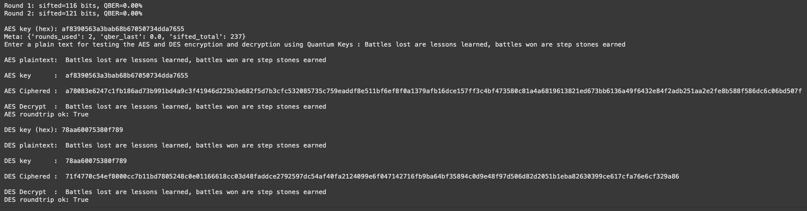
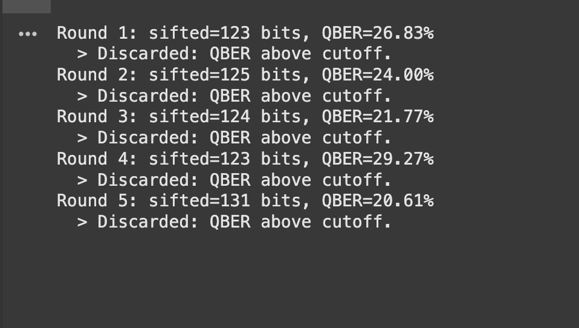
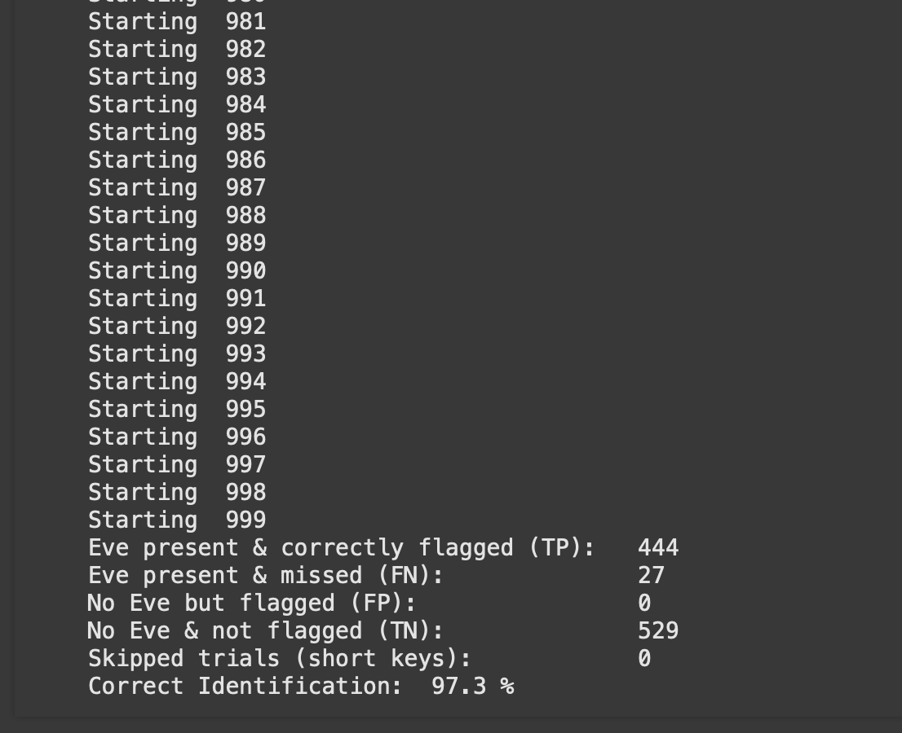

<p align='center'></p>

# CrypTon

## 📝 Brief Overview 
CrypTon is a Quantum Key Distribution system which uses randomly generated quantum bits to assign a key for AES and DES encryption. It is fast, robust and a great tool to assist in cryptography and securing the data that is transmitted over internet. 

---

## 📸 Screenshots 
<p align='center'><br><em>Fig : Results with Eve(Interceptor) Not Present</em></p><br><br>
<p align='center'><br><em>Fig : Results with Eve(Interceptor) Present</em></p><br><br>
<p align='center'><br><em>Fig : Testing BB84 Protocol for transferring quantum keys for 1000 random cases with random probability of expecting Eve(Interceptor)</em></p><br><br>

---

## 📚Tech Stack
<p align='center'>


</p>

--- 

## 🖥️ Local Setup

#### Cloning the Google Colab
```bash
Open the Google Colab and clone the QKD.ipynb
Connect to CPU runtime (You can use GPU or TPU or any other runtime suitable as per your needs)
Click Run All
```

---

## 📃 License

MIT License © 2025 VisheshVerse

---
## 🙋‍♂️ Author

This project represents hours of engineering, experimentation, and perseverance. If CrypTon helped you, inspired you, or made you think — I’d love to hear from you.

Feel free to ⭐ the repo or connect with me at visheshvishu1@outlook.com

And until next time, stay curious.

**Vishesh Goyal**  
[GitHub](https://github.com/Vishesh-Goyal7) | [Personal Portfolio](https://visheshverse.com)

---


